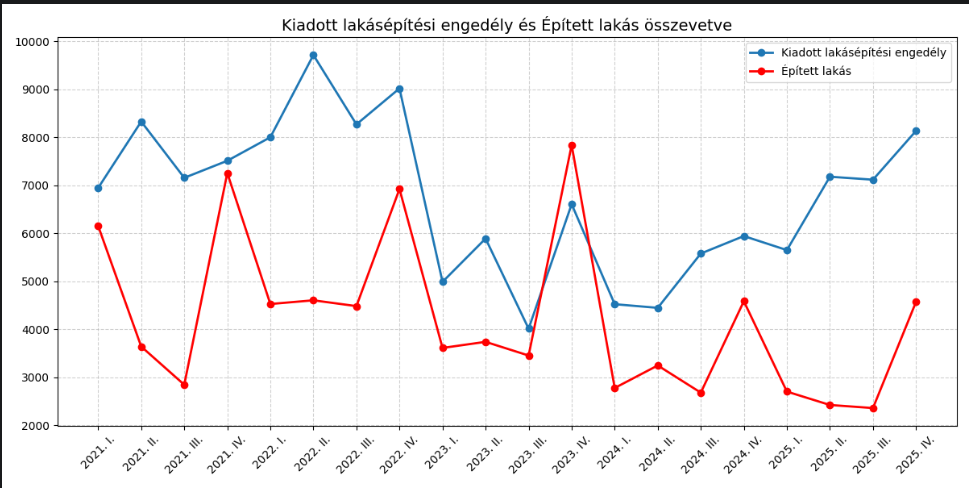

# KSH Lakáspiaci Adatfeldolgozó 🏠📊

Ez egy Python-alapú eszköz a KSH (Központi Statisztikai Hivatal) lakáspiaci adatainak elemzésére és vizualizációjára. A projekt célja a magyarországi lakásépítési adatok, árindexek és tranzakciószámok időbeli alakulásának bemutatása, valamint jövőbeli trendek becslése lineáris regresszió segítségével.

## ✨ Funkciók
- **Automatikus adattisztítás:** A KSH-s CSV formátum kezelése (ékezetek, szóközök és hiányzó értékek kezelése).
- **Interaktív menü:** Könnyen kezelhető konzolos felület a különböző lekérdezésekhez.
- **Dinamikus vizualizáció:** Idősoros grafikonok generálása bármelyik választott oszlophoz.
- **Lineáris regresszió:** Trendelemzés és jövőbeli becslés az összevont lakáspiaci árindex alapján.
- **Összehasonlító elemzés:** Több adatsor (pl. kiadott engedélyek vs. felépült lakások) egyidejű megjelenítése egy grafikonon.

## 🛠️ Technológiai stack
- **Python 3.x**
- **Pandas:** Adatkezelés és tisztítás.
- **Matplotlib:** Grafikonok és diagramok készítése.
- **Scipy:** Statisztikai számítások (lineáris regresszió).

## 📊 Grafikon példa


## 🚀 Telepítés és használat

1. **Klónozd a tárolót:**
   ```bash
   git clone [https://github.com/krisztianszabo-dev/ksh-housing-analysis.git](https://github.com/krisztianszabo-dev/ksh-housing-analysis.git)
